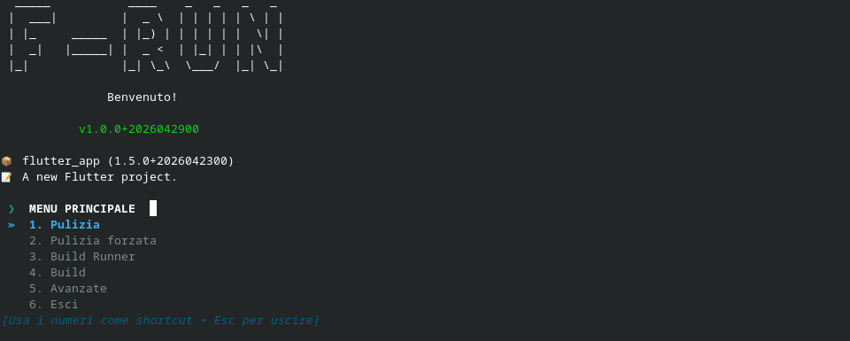

# 🚀 F-Run



**Una CLI Rust per automatizzare il workflow di sviluppo Flutter**


F-Run è uno strumento da riga di comando scritto in Rust che **automatizza operazioni ripetitive** nello sviluppo Flutter. È un orchestratore di tool esterni (Flutter SDK, Fastlane, Shorebird, xcrun) che riduce errori manuali e accelera il ciclo di sviluppo.

**Non replica tool esistenti, ma li coordina intelligentemente** per flussi complessi come build multi-flavor, upload su store e generazione di asset.

---

## 📋 Caratteristiche

### 🔧 Rilevamento automatico della configurazione
F-Run scansiona il progetto e popola `frun.yaml` con informazioni rilevate automaticamente:
- **Flavors Android** da `android/app/src/`
- **Supporto iOS** da `ios/Runner/Info.plist`
- **Fastlane** da `android/Fastfile`
- **Shorebird** da `shorebird.yaml`
- **Supporto generatori** da `pubspec.yaml` per `icons_launcher`, `flutter_native_splash`, `katana_localization`

### 📦 Build multipiattaforma
- **Android APK**: build dell’APK standard
- **Android AAB**: build dell’App Bundle
- **iOS IPA**: build e upload su App Store Connect (solo macOS)
- **Build per flavor**: supporto per flavor selezionabili se presenti nel progetto
- **Stage `development` / `production`**: gestito dal menu di build

### 🎯 Generazione di asset e localizzazioni
- **Icone**: `icons_launcher:create` con config in `assets/icons/` o `assets/{flavor}/icons/`
- **Splash screen**: `flutter_native_splash:create` con config in `assets/icons/` o `assets/{flavor}/icons/`
- **Localizzazioni Katana**: generazione con `katana_localization` quando attivo e configurato

### 🚀 Integrazioni esterne
- **Fastlane**: supporto Android + iOS con flusso basato su `android/fastlane/Appfile` e `supply_{flavor}.json`
- **Shorebird**: build e deploy via CLI Shorebird quando `shorebird.yaml` è presente
- **xcrun / altool**: usati per il deployment iOS su macOS
- **Dart build_runner**: build e watch integrati nel menu


### 🛠️ Utility
- Menu interattivi per selezionare azioni, piattaforme e flavor
- Pulizia progetto con `flutter clean` e rimozione delle build temporanee
- Spostamento automatico di APK/AAB/IPA nella cartella `~/Downloads`
- Supporto per terminale esterno in modalità `build_runner watch` su macOS, con fallback su esecuzione integrata su altre piattaforme

---

## 🛠️ Come compilare e sviluppare

### Prerequisiti
- **Rust 1.70+**: Download da https://rustup.rs/
- **Cargo** (incluso con Rust)
- **Progetti testati su**: macOS 10.14+, Linux (Ubuntu/Debian), Windows (limitato)

### Build locale

```bash
# Clone il repository
git clone https://github.com/yourusername/f-run.git
cd f-run

# Semplice: build debug
cargo build

# Ottimizzato: release con profilo custom
cargo build --release
```

### Controllare il codice

```bash
# Format (Rustfmt)
cargo fmt

# Lint strict (come da Cargo.toml)
cargo clippy

# Entrambi assieme
cargo c && cargo clippy
```

### Script build rapido: `run.sh`

```bash
./run.sh
```

Mostra un menu con opzioni:
1. **Build**: compila release, sposta binario in `~/Downloads`
2. **Documentazione**: apre `cargo doc --open`
3. **Analizza**: esegue `cargo clippy` e `cargo check`

Opzioni avanzate:
```bash
# Specifica operazione
./run.sh -s 1      # Diritto a build

# Help
./run.sh -h
```

### Profilo di release

F-Run usa un profilo release **aggressivo** (configurato in `Cargo.toml`):
```toml
[profile.release]
opt-level = "z"           # Minimizza dimensione
lto = "fat"               # Link-time optimization globale
codegen-units = 2         # Riduce parallelismo (miglior ottimizzazione)
strip = "symbols"         # Rimuove simboli di debug
panic = "abort"           # Crash istantaneo, no unwinding
debug = false             # Nessun info debug
incremental = false       # Build completa
```

**Risultato**: binario compatto (~8 MB) e veloce. Trade-off: tempi di build aumentano.

---

## 📝 Configurazione: `frun.yaml`

F-Run crea e gestisce un file `frun.yaml` nella radice del progetto.

### Struttura completa

```yaml
features:
  fastlane: true                          # Rilevato automaticamente
  shorebird: false                        # Rilevato automaticamente
  icons_launcher: true                    # Rilevato da pubspec.yaml
  flutter_native_splash: true             # Rilevato da pubspec.yaml
  katana:
    enabled: true                         # Rilevato: katana_localization in pubspec.yaml
    language_path: "lib/language.dart"    # Path del file di lingua (se Katana attivo)

flavors:
  enabled: true                           # Se true, la build richiede di scegliere un flavor
  list:
    - "myflavor"
    - "otherflavor"
    - "testflavor"

ios:
  enabled: true                           # Rilevato: Info.plist in ios/Runner/
  app_store_acc: "your-apple-id@example.com"  # Per upload
  app_store_password: "xxxx-xxxx-xxxx-xxxx"   # App-specific password (non password Apple ID!)
```

### Rilevamento automatico

Alla prima esecuzione, F-Run:
1. **Legge** `pubspec.yaml` per cercare Katana, Fastlane, flutter_native_splash, icons_launcher
2. **Scansiona** `android/app/src/` per trovare flavors (es. myflavor, production)
3. **Verifica** `ios/Runner/Info.plist` per supporto iOS
4. **Cerca** `shorebird.yaml` nella radice
5. **Scrive** `frun.yaml` con i risultati

Se il progetto cambia, cancella `frun.yaml` per riavviare il rilevamento.

---

## 📂 Struttura file: convenzioni per il progetto Flutter

### Environments e configurazione

```
project/
├── environment/
│   ├── production.json        # Ambiti globali (tutti i flavor)
│   ├── staging.json
│   ├── myflavor/
│   │   ├── production.json    # Specifico del flavor
│   │   └── staging.json
│   └── otherflavor/
│       ├── production.json
│       └── staging.json
```

F-Run **non crea questi file**, ma li usa quando gli chiedi una build (scegli `development` o `production`).

### Icons e Splash

```
project/
├── assets/
│   ├── icons/
│   │   ├── icons_launcher.yaml
│   │   └── flutter_native_splash.yaml
│   ├── myflavor/
│   │   └── icons/
│   │       ├── icons_launcher.yaml
│   │       └── flutter_native_splash.yaml
```

Quando generi icons/splash, F-Run legge ogni config `icons_launcher.yaml` e `flutter_native_splash.yaml` e esegue `dart run icons_launcher:create` / `dart run flutter_native_splash:create`.

### Main entry point con flavor

```
project/
├── lib/
│   ├── main.dart              # Senza flavor
│   └── flavors/
│       ├── main_myflavor.dart
│       └── main_otherflavor.dart
```

### Fastlane (Android)

```
project/
├── android/
│   ├── Fastfile               # Configurazione principale
│   ├── supply.json            # Credenziali (no flavor)
│   └── supply_myflavor.json   # Credenziali specifiche del flavor
```

---

### Piattaforme supportate

| Feature | macOS | Linux | Windows |
|---------|-------|-------|---------|
| Clean | ✅ | ✅ | ✅ |
| Build Runner | ✅ | ✅ | ✅ |
| Build APK | ✅ | ✅ | ✅ |
| Build AAB | ✅ | ✅ | ✅ |
| Build IPA | ✅ | ❌ | ❌ |
| Upload App Store | ✅ | ❌ | ❌ |
| Terminale separato (watch) | ✅ | ✅ | ⚠️ (fallback) |
| Katana localization | ✅ | ✅ | ✅ |
| Fastlane | ✅ | ✅ | ⚠️ (partial) |

**Note**:
- **iOS/IPA**: Richiede macOS e Xcode. Usa `xcrun` e `altool` (solo Apple)
- **Fastlane**: Cross-platform, ma alcune feature richiedono macOS
- **Terminale separato**: Fallback a shell normale se non supportato

### Feature detection automatico

| Feature | Detection method | Fallback |
|---------|------------------|----------|
| Flavors Android | Legge `android/app/src/` | `enabled: false` |
| iOS | Verifica `ios/Runner/Info.plist` | `enabled: false` |
| Katana | Cerca `katana_localization` in `pubspec.yaml` | `enabled: false` |
| Icons Launcher | Cerca `icons_launcher` in `pubspec.yaml` | `enabled: false` |
| Native Splash | Cerca `flutter_native_splash` in `pubspec.yaml` | `enabled: false` |
| Shorebird | Verifica `shorebird.yaml` in radice | `enabled: false` |
| Fastlane | Cerca `Fastfile` in `android/` | `enabled: false` |

---

## 🤝 Come contribuire

### Linee guida

1. **Organizzazione**: Rispetta la struttura modulare (config, core, features, ui)
2. **Naming**: Inglese tecnico per simboli, italiano per messaggi utente
3. **Lint**: `cargo fmt && cargo clippy` (strict warnings abilitati in root)
4. **Unwrap**: Vietato! Usa `unwrap_or_else()` + `error_and_exit()` oppure `Result`
5. **Doc**: Rustdoc con sezioni `# Parametri`, `# Return`, `# Panics`
6. **Test**: Non obbligatori (no test suite principale), ma consigliati

### Passi

1. Fork il repo
2. Crea branch: `git checkout -b feature/my-feature`
3. Commit: `git commit -am "Descrizione in italiano"`
4. Push: `git push origin feature/my-feature`
5. Pull Request

---

## 📝 Licenza

[MIT License](LICENSE)

---

## 💬 Supporto

- 🐛 Segnala bug: [GitHub Issues](https://github.com/Mirko-r/F-Run/issues)
- 💡 Proposte: [GitHub Discussions](https://github.com/Mirko-r/F-Run/discussions)
- 📖 Doc interna: `cargo doc --open`

---

**Strumento costruito per streamlineare lo sviluppo Flutter. ❤️**
